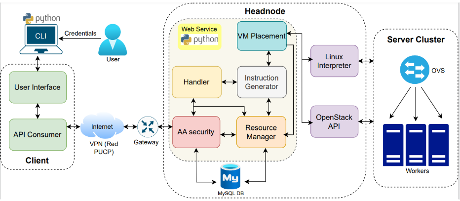

# TEL141 - INGENIERÍA DE REDES CLOUD - PROYECTO
## OLIMPUS SYSTEMS - ORQUESTADOR OPENSTACK/LINUX
Este proyecto se desarrolla como un prototipo de una capa superior de personalización para gestión de slices, flavors, imágenes y usuarios. En este contexto, las diversas opciones que ofrece este proyecto brindan al usuario la experiencia de crear máquinas virtuales de acuerdo a la topología preferida, elegir sus parámetros y la zona de disponibilidad a implementar.
Se desarrolla bajo el modelo de un controlador central (Headnode) y un cluster de servidores (Workers), los cuales poseen el la distribución Ubuntu de Linux. Asimismo, esta implementación, en este nivel de versión se implementa en CLI mediante el lenguaje de programación Python en su versión 3, y se integra a Openstack Victoria mediante consultas APIs, y una base de datos MySQL.
### La arquitectura es la siguiente:

### Dependencias necesarias:
Los requerimientos en dependencias y versiones de python para este proyecto se encuentran en el archivo a continuación, asimismo, se sugiere instalarlas en un entorno virtual.
[Requerimientos](requirements.txt)
## Estructura del proyecto e instalación
El proyecto consta de dos partes, cliente y servidor, ambos en python 3.
Asimismo, en cuanto a equipos de cómputo, tenemos: computadora local, controlador (Headnode), gateway y cluster de servidores (Worker 1, 2 y 3)
1. En el headnode y workers se instala Openstack y se configuran e instalan las herramientas de **Chrony**, **MariaDB**, **RabbitMQ**, **Memcached**, **Etcd**; y los servicios de **Openstack**: *Keystone*,  *Glance*, *Placement*, *Nova*, *Neutron*, *Horizon*
2. Dar salida a los servicios de openstack con iptables en el gateway: `iptables -t nat -A PREROUTING -p tcp -m tcp --dport XXXX -j DNAT --to-destination 10.0.10.2:XXXX`, donde *XXXX* es el puerto al que se le desea dar salida
3. Dado que el servidor se usará en el puerto 8000, dar salida también a este puerto en el gateway: `iptables -t nat -A PREROUTING -p tcp -m tcp --dport 8000 -j DNAT --to-destination 10.0.10.2:8000`
4. En el gateway, crear una llave SSH para ejecutar comandos remotamente al headnode:
```
ssh-keygen -t ecdsa -b 256 -C "Olimpus"
ssh-copy-id -i headkey ubuntu@10.0.10.2
scp headkey ubuntu@10.0.10.2:/home/ubuntu
```
5. Instalación de docker:
```
sudo apt update
sudo apt remove docker docker-engine docker.io containerd runc
echo 'nameserver 8.8.8.8' >> /etc/resolv.conf 
sudo apt install apt-transport-https ca-certificates curl software-properties-common
curl -fsSL https://download.docker.com/linux/ubuntu/gpg | sudo gpg --dearmor -o /usr/share/keyrings/docker-archive-keyring.gpg
echo "deb [signed-by=/usr/share/keyrings/docker-archive-keyring.gpg] https://download.docker.com/linux/ubuntu $(lsb_release -cs) stable" | sudo tee /etc/apt/sources.list.d/docker.list > /dev/null
echo 'nameserver 8.8.8.8' >> /etc/resolv.conf 
sudo apt update
sudo apt install docker-ce docker-ce-cli containerd.io
```
6. Creación del docker de MySQL:
`docker run -d -p 4000:3306 --name mysql-cloud -e MYSQL_ROOT_PASSWORD=cloud2023 mysql:8.0`
7. Instalación y creación del entorno virtual en python
```
sudo apt install python3.8-venv
python3 -m venv env-cloud
```
8. Activación del entorno virtual *env-cloud*
source env-cloud/bin/activate
9. Dentro del entorno virtual, instalar las dependencias requeridas:
`pip install -r requirements.txt`
10. Luego de copiar la carpeta del servidor, correr el servidor con:
`nohup python servidorPy.py > salida.log 2>&1 &`